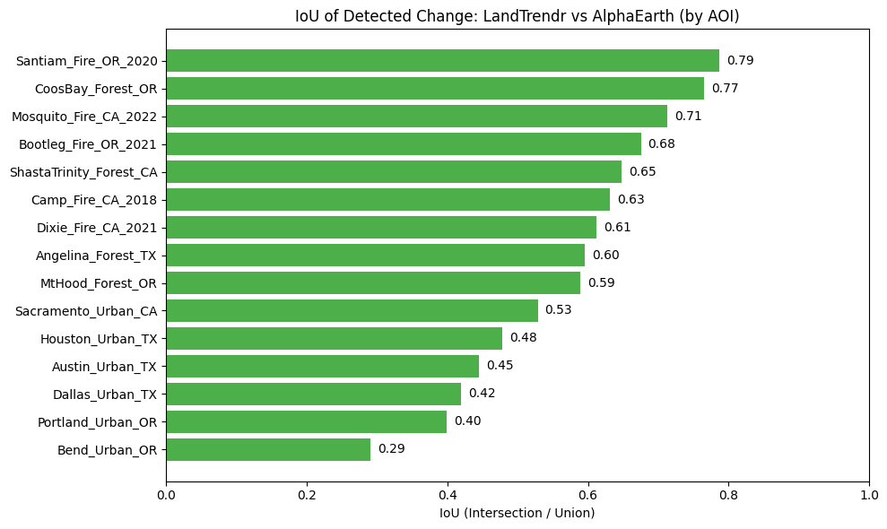

# AlphaEarth Change Detection — UT Austin Geoscience Hackathon

Our project leverages cutting-edge remote sensing to identify and monitor land cover changes, visualizing our changing world with effective and efficient data sources. By integrating advanced algorithms and datasets, we provide a comprehensive tool for understanding the dynamics of our changing planet — supporting researchers and professionals across geography and geology to detect, measure, and analyze the changes that interest them.

Click [here](https://ktwu01.github.io/AlphaEarthHack/) for an **interactive dashboard**.

For a narrative walkthrough, open [`notebooks/AlphaEarth_Story.ipynb`](./notebooks/AlphaEarth_Story.ipynb) (visualizations are interactive and cannot be rendered on GitHub; see screenshots below).

---

## Team Alpha

**Mentor:** Dr. Brendon Hall — Sr. Manager in AI for Energy & Utilities, Deloitte


---

## Quickstart

### 1. Set up the environment

```bash
conda env create -f environment.yml
conda activate alphaearth
```

### 2. Authenticate with Google Earth Engine

```bash
earthengine authenticate
python -m ipykernel install --user --name alphaearth --display-name "alphaearth"
```

> **Need a GEE project?** Register at [earthengine.google.com](https://earthengine.google.com). Free tier is sufficient.

### 3. Launch notebooks

```bash
jupyter lab
```

Run in this order:

| # | Notebook | Purpose |
|---|----------|---------|
| 1 | `notebooks/alpha_tutorial.ipynb` | AlphaEarth K-means clustering intro |
| 2 | `notebooks/AlphaEarth_Story.ipynb` | Main narrative: cosine similarity, dam detection, Austin urban growth |
| 3 | `notebooks/AlphaEarth_Interactive_Mapping.ipynb` | Draw AOI → real-time change detection + inspector |
| 4 | `notebooks/AlphaEarth_LandTrendr_ChangeComparison.ipynb` | Side-by-side comparison across 15 sites + IoU analysis |
| 5 | `notebooks/LandTrendr_AlphaEarth.ipynb` | Deep-dive LandTrendr statistics; exports CSVs to `outputs/` |

### 4. Smoke test (no GEE auth required)

```bash
python -m scripts.smoke_test
```

---

## What We Built

Detect and compare land-use change across 15 western U.S. sites using two complementary algorithms:

| Algorithm | Method | Time range |
|-----------|--------|------------|
| **AlphaEarth** | Cosine similarity on 64-dim satellite embeddings (`GOOGLE/SATELLITE_EMBEDDING/V1/ANNUAL`) | 2017–2024 |
| **LandTrendr** | Spectral-temporal NDVI trajectory fitting (Landsat) | 2016–2024 |

Both produce three standardized layers — **YOD** (year of change), **MAG** (magnitude), **DUR** (duration) — and IoU analysis compares their overlap.

**Study sites (15):**

| Category | Sites |
|----------|-------|
| **Urbanization** | Austin TX, Dallas TX, Houston TX, Bend OR, Portland OR, Sacramento CA |
| **Wildfires** | Bootleg OR (2021), Camp Fire CA (2018), Dixie CA (2021), Mosquito CA (2022), Santiam OR (2020) |
| **Forest / Logging** | Angelina TX, Coos Bay OR, Mt Hood OR, Shasta-Trinity CA |

---

## Repository Layout

```
AlphaEarthHack/
├── notebooks/          # Main Jupyter notebooks (run in order above)
├── scripts/            # smoke_test.py
├── src/                # Shared constants (EE asset paths, thresholds)
├── images/             # Figures referenced in notebooks and README
├── outputs/            # Generated CSVs / PNGs (git-ignored)
├── data/               # Local data placeholder (git-ignored)
├── backup/             # Archived exploratory notebooks
├── environment.yml     # Conda environment spec (Python 3.12)
└── pyproject.toml      # Ruff lint config
```

---

## Visualizations

| Global View | Years Side-By-Side |
| :---: | :---: |
|  |  |

| Cosine Similarity (areas of change) | Similar Feature Detection |
| :---: | :---: |
|  |  |

| AlphaEarth Magnitude | AlphaEarth Duration |
| :---: | :---: |
|  |  |

| LandTrendr Magnitude | LandTrendr Duration |
| :---: | :---: |
|  |  |

| Interactive Dissimilarity Plot | Export Options |
| :---: | :---: |
|  |  |



---

## Open Source Libraries & Datasets

Google DeepMind · Google AlphaEarth · LandTrendr · GeoAI · NumPy · tqdm · ipyleaflet · Google Earth Engine · Leaflet.js · Plotly.js

---

## References

Brown, C. F., et al. (2025). *AlphaEarth Foundations*. arXiv:2507.22291.

Kennedy, R. E., et al. (2018). Implementation of the LandTrendr Algorithm on Google Earth Engine. *Remote Sensing*, 10(5), 691.

Gorelick, N., et al. (2017). Google Earth Engine: Planetary-scale geospatial analysis for everyone. *Remote Sensing of Environment*, 202, 18–27.

Harris, C. R., et al. (2020). Array programming with NumPy. *Nature*, 585, 357–362.

Janowicz, K., et al. (2020). GeoAI. *Int. J. Geographical Information Science*, 34(4), 625–636.

da Costa-Luis, C. O. (2019). tqdm. *Journal of Open Source Software*, 4(37), 1277.

---

## License

BSD 3-Clause — see [LICENSE](LICENSE).
